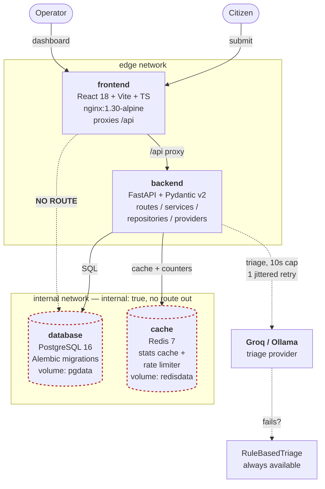
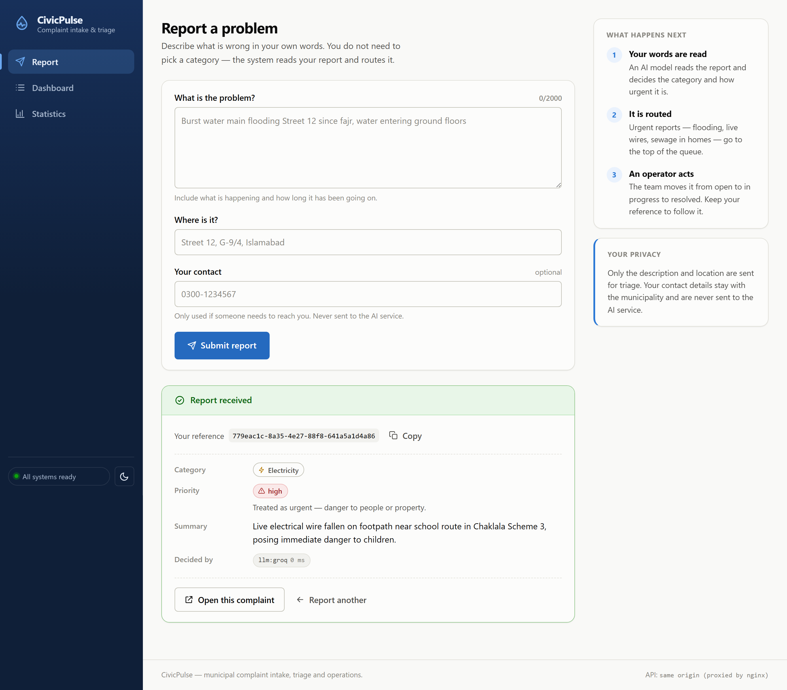
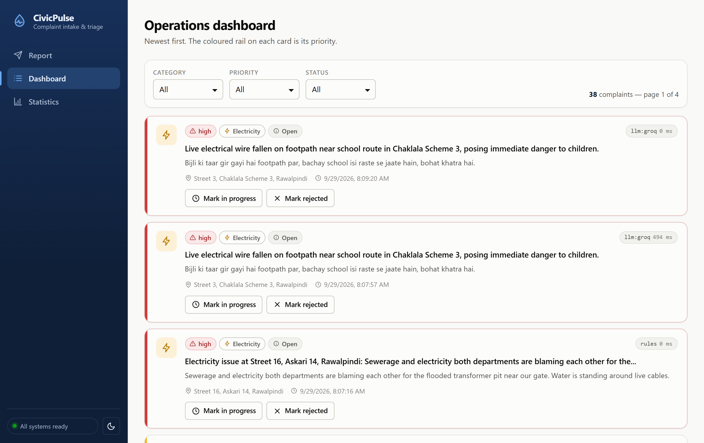
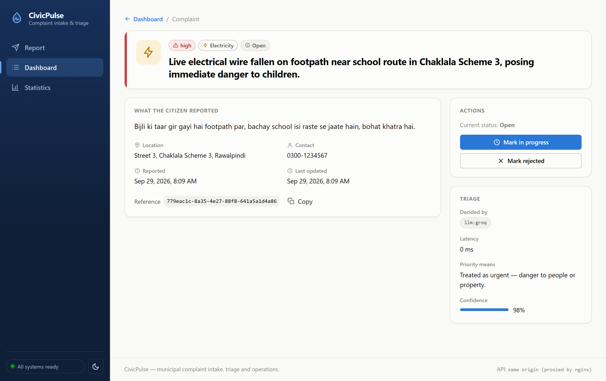
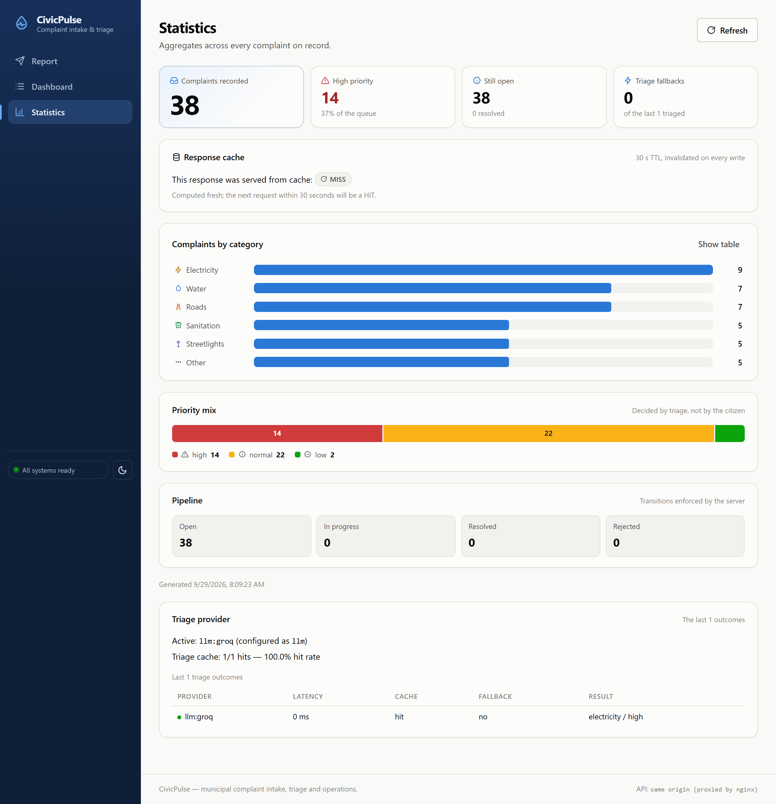
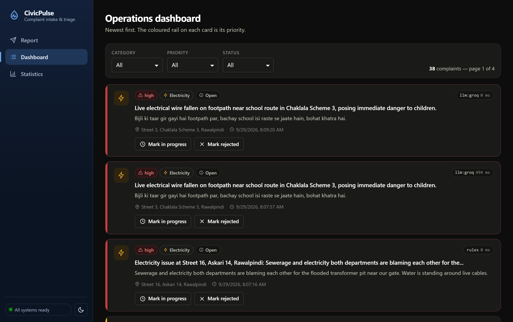
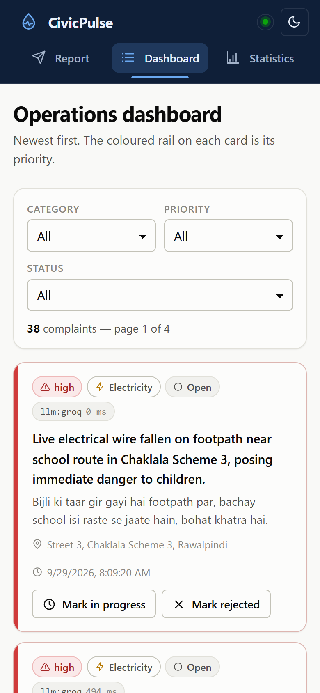

# CivicPulse

Municipal complaint intake, AI triage and operations — five cooperating
containers locally, an autoscaling workload on Kubernetes in CI.

[](https://github.com/i222641-byte/SCD_A1/actions/workflows/ci.yml)
[](https://github.com/i222641-byte/SCD_A1/actions/workflows/cd.yml)
[](#testing)
[](LICENSE)

---

## The problem

Every municipality runs the same broken process. A citizen reports

> "burst water main flooding Street 12 since fajr, water entering ground floors"

into a form. That free text lands in an undifferentiated queue. On a Monday the
queue is four hundred items long, and the burst main sits behind three
streetlight complaints, because nothing sorted them. By the time a human reads
it, a street is flooded.

The naive fix is a dropdown. It fails for reasons worth understanding: citizens
pick wrong, pick "Other" to get through the form faster, and cannot judge
urgency. **The information is already in the text. Somebody has to read it.**

The engineering problem is not the reading. It is that **the reader must be
replaceable** — today a keyword rule, tomorrow a language model, next year a
fine-tuned classifier — and the system around it must not care which, and must
not fall over when the clever one is rate-limited, slow, or simply wrong.

---

## Architecture



**The frontend cannot reach the database.** It is the internet-facing component
and therefore the most likely to be compromised, so it has no route to the data.
The backend is the single, auditable bridge between the two networks. Demonstrate
it:

```bash
docker compose exec frontend ping database    # fails, by design
```

### Why each piece is here

| Piece | What it forces |
|---|---|
| A real frontend | CORS, a build step, runtime configuration, a multi-stage image, an origin that is not localhost |
| An AI step we do not control | Structured output, schema validation, timeout, retry, fallback, caching for cost, rate limiting |
| PostgreSQL with migrations | Persistence, volumes, StatefulSets, readiness that means something |
| Redis doing two jobs | Cache semantics *and* a distributed rate limiter — one piece of infrastructure, two capabilities |
| Two Docker networks | Network segmentation you can prove with a failing command |
| Kubernetes + HPA | Declarative operations, resource budgeting, the fact that autoscaling is impossible without requests |

---

## Quickstart

One command, from a clean clone, with seeded data.

**Prerequisites:** Docker with Compose v2. Nothing else — no Python, no Node, no
API key.

```bash
git clone https://github.com/i222641-byte/SCD_A1.git civicpulse
cd civicpulse

cp .env.example .env        # then change POSTGRES_PASSWORD for anything real
docker compose up -d --build
```

Open **<http://localhost:8080>**.

That single `up` builds both images, starts Postgres and Redis, waits for them
to be healthy, runs the one-shot **`migrate`** job (`alembic upgrade head`
plus the idempotent seed), and only then starts the backend and frontend. You
get 36 realistic complaints across all six categories, triaged by the keyword
provider — no API key needed, and it works offline.

Schema changes still never run in application startup code: `migrate` is a
separate container that exits when it is done, and the backend is gated on it
with `condition: service_completed_successfully`.

### Turn on the real AI

Sign up at <https://console.groq.com> (free, no credit card), then:

```bash
# in .env
TRIAGE_PROVIDER=llm
LLM_API_KEY=gsk_your_key_here
```

```bash
docker compose up -d backend
curl -s localhost:8000/api/meta/providers | jq .active_provider   # "llm:groq"
```

### Or run the model locally, with no key and no data leaving your machine

```bash
docker compose --profile ai up -d ollama
docker compose exec ollama ollama pull llama3.2:1b
# then set TRIAGE_PROVIDER=ollama in .env and restart the backend
```

### Deploy to Kubernetes

```bash
k3d cluster create civicpulse -p "8081:80@loadbalancer"
k3d image import civicpulse-backend:dev civicpulse-frontend:dev -c civicpulse
kubectl apply -k k8s/overlays/dev
kubectl -n civicpulse wait --for=condition=available deploy --all --timeout=300s

echo "127.0.0.1 civicpulse.local" | sudo tee -a /etc/hosts
open http://civicpulse.local:8081
```

---

## API

Base path `/api`. Full OpenAPI schema at `/docs` and `/openapi.json`.

| Method | Path | Behaviour |
|---|---|---|
| `POST` | `/api/complaints` | Validate → triage → persist. **201**. **400** with a field-level error body. **429** with `Retry-After` when over the rate limit. |
| `GET` | `/api/complaints/{id}` | **200** / **404** |
| `GET` | `/api/complaints` | Filter by `category`, `priority`, `status`; paginate (`page`, `page_size` ≤ 100); returns `total`. |
| `PATCH` | `/api/complaints/{id}/status` | Enforces the state machine. Invalid transition → **409** naming the attempted transition. |
| `GET` | `/api/stats` | Aggregates, Redis-cached, 30s TTL, `X-Cache: HIT\|MISS`. |
| `GET` | `/api/meta/providers` | Active provider and the last 20 triage outcomes (provider, latency, fallback, cache hit). |
| `GET` | `/health` | Liveness. **Does not touch the database.** |
| `GET` | `/ready` | Readiness. 200 only if Postgres *and* Redis are reachable; **503** naming the failed dependency. |
| `GET` | `/metrics` | Prometheus text format. |

### Status state machine

```
open ──> in_progress ──> resolved   (terminal)
  │            │
  └────────────┴──────> rejected    (terminal)
```

Everything else is a **409** naming the attempted transition. Implemented as an
explicit transition table (`backend/app/domain/state_machine.py`), and every
complaint response carries `allowed_transitions` — **the frontend holds no copy
of these rules**.

### Try it

```bash
# Submit
curl -s -X POST localhost:8000/api/complaints \
  -H 'Content-Type: application/json' \
  -d '{"text":"Burst water main flooding Street 12 since fajr, water entering ground floors.","location":"Street 12, G-9/4, Islamabad"}' | jq

# Watch the cache: MISS then HIT
curl -si localhost:8000/api/stats | grep -i x-cache
curl -si localhost:8000/api/stats | grep -i x-cache

# Invalid transition: a 409 that tells you what to do instead
ID=$(curl -s 'localhost:8000/api/complaints?page_size=1' | jq -r .items[0].id)
curl -s -X PATCH "localhost:8000/api/complaints/$ID/status" \
  -H 'Content-Type: application/json' -d '{"status":"resolved"}' | jq
```

---

## The AI layer

Calling an LLM is four lines. Making a system that depends on one trustworthy is
the assignment.

**Four providers**, one interface, selected by `TRIAGE_PROVIDER`:

| Provider | Key? | Network? | Use |
|---|---|---|---|
| `llm` | yes | yes | Production. Groq by default, any OpenAI-compatible endpoint. |
| `ollama` | no | local only | Zero data egress. |
| `rules` | no | no | Fallback. Never fails, so everything else can. |
| `simulated` | no | no | CI. Deterministic, with failure injection. |

**Seven defences**, all tested:

1. **Structured output, enforced** — JSON mode *and* Pydantic validation.
   JSON mode guarantees syntax, never semantics: an invented category is
   rejected, never coerced to `other`.
2. **10s hard timeout** — applied by us, not delegated to a client library.
3. **One jittered retry, on retryable errors only** — 429, 5xx and timeouts.
   Never a 400: it was wrong when we sent it and will be wrong in 300ms.
4. **Fallback to keyword rules** — `triaged_by = "rules:fallback"`. A citizen
   never sees a 500 because a third party was rate-limited.
5. **Content-hash cache, 24h** — nine neighbours reporting one burst main cost
   one inference. Hit rate measured and reported at `/api/meta/providers`.
6. **The key is never logged** — redacted at source, scrubbed in the formatter,
   and the submission lint fails on a credential anywhere in Git history.
7. **Prompt-injection guardrail** — the complaint is delimited and labelled as
   untrusted data, the output is a closed enum, and it is validated regardless.
   A test submits an injection and asserts the schema still decides.

Full detail in **[docs/TRIAGE.md](docs/TRIAGE.md)**.

---

## Interface

Two audiences, one design system.

A **citizen** meets the Submit view once, probably on a phone, probably upset.
It gets air, large targets and plain language: the priority the system assigned
is explained in a sentence rather than left as an enum, and the form says
outright that the contact field is never sent to the AI service.

An **operator** lives in the Dashboard all day. It gets density and a priority
signal readable before you read a word &mdash; a coloured rail down the edge of
each card, thicker on `high`.

Both get a real dark mode: its own selected steps against a dark surface, not an
automatic inversion of the light values.

| | |
|---|---|
|  |  |
| **Submit** &mdash; the triage result as a receipt | **Dashboard** &mdash; priority rail, server-driven transitions |
|  |  |
| **Complaint** &mdash; one complaint, its triage, server-driven actions | **Statistics** &mdash; tiles, category bars, priority mix |
|  |  |
| **Dark mode** &mdash; its own palette, not an inversion | **390 px** &mdash; the sidebar becomes a top bar |

Every view has a real URL, so refresh keeps your place, the back button works,
and a complaint can be linked from a chat. Each page maps onto the §2.2 contract:

| URL | View | API it calls |
|---|---|---|
| `/` | Report a problem | `POST /api/complaints` |
| `/dashboard` | Operations dashboard | `GET /api/complaints`, `PATCH /api/complaints/{id}/status` |
| `/complaints/{id}` | One complaint | `GET /api/complaints/{id}`, `PATCH /api/complaints/{id}/status` |
| `/stats` | Statistics | `GET /api/stats`, `GET /api/meta/providers` |
| (every page) | Health indicator | `GET /ready` |

Every number on every page comes from the API &mdash; there is no hardcoded
data in the frontend. There is also deliberately **no sign-up or sign-in**:
the brief specifies none, and §2.1 limits the frontend to "a submission form and
an operations dashboard. Nothing else."

Each category has one hue and one icon everywhere it appears. Categories use a
neutral chip with a coloured icon, while priority uses a filled pill, so an amber
*electricity* chip can never be mistaken for an amber *normal* priority.

**Colour never carries meaning alone.** Every priority and status pairs a hue
with an icon and a word, so the UI survives colour-blindness, a greyscale print
and Windows high-contrast mode. The one chart whose palette sits below 3:1 on a
light surface (the priority mix, which uses the fixed status colours) ships
direct labels, an icon-and-word legend and a one-click table view &mdash; a
colour you cannot see has to be readable some other way.

**Chart decisions were made form-first, then colour:**

- *Complaints by category* is **one** series (a count) across six identities, so
  it is a horizontal bar chart in **one** hue. Six categorical hues would claim
  six series that do not exist.
- *Priority mix* is severity, not identity, so it uses the fixed status palette
  as a 100%-stacked bar &mdash; the operator's question is "how much of the queue
  is urgent", which is a mix, not six magnitudes.
- *Pipeline* is four numbers, so it is four numbers. A chart there would be
  decoration.

Accessibility is wired in rather than bolted on: a skip link as the first tab
stop, `aria-current` on the active tab, `aria-invalid` plus `aria-describedby`
on every field, a live-region health indicator driven by `/ready`, visible focus
rings, and a `prefers-reduced-motion` guard over every transition.

---

## Testing

```
backend    112 tests, 88.6% coverage, ruff clean, mypy clean
frontend    41 tests, tsc clean, eslint clean
contract   frontend types checked against the backend OpenAPI schema
manifests   18 files, kubeconform clean
```

```bash
cd backend && pip install -r requirements-dev.txt && pytest --cov=app
cd frontend && npm ci && npm test
```

The whole suite runs with **no Postgres, no Redis and no network** — SQLite in
memory, an in-process cache, and the deterministic provider. A suite that needs
three containers to be green is a suite people skip.

**The test that matters most**, per the spec: given a provider that always
raises, `POST /api/complaints` still returns **201** with
`triaged_by == "rules:fallback"`.
(`backend/tests/test_triage_resilience.py`)

There is **no `time.sleep()` anywhere in the suite** and no test is re-run to
get a pass. Jitter is injected; failure is injected; determinism is a design
property, not luck.

---

## Repository layout

```
backend/    FastAPI. routes/ services/ repositories/ providers/ — arrows point one way.
            providers/triage/{base,llm,ollama,rules,simulated,factory}.py
            alembic/versions/   the only place DDL is ever emitted
frontend/   React 18 + Vite + TS. nginx serves and proxies /api.
k8s/        Kustomize. base/ + overlays/{dev,prod}
load/       k6 profile for the HPA demonstration
docs/       ADRs, engineering notes, runbook, AI usage, triage
scripts/    check_submission.py — a lint, not a grader
```

---

## Documentation

| Document | What it answers |
|---|---|
| [ENGINEERING-NOTES.md](docs/ENGINEERING-NOTES.md) | The eight questions, with file-and-line references |
| [RUNBOOK.md](docs/RUNBOOK.md) | Deploy, roll back, read logs, what to do when triage starts failing |
| [TRIAGE.md](docs/TRIAGE.md) | How the AI layer works and how it degrades |
| [AI-USAGE.md](docs/AI-USAGE.md) | Honest disclosure of AI assistance |
| [ADR 0001](docs/adr/0001-provider-interface.md) | Why a provider interface |
| [ADR 0002](docs/adr/0002-frontend-runtime-config.md) | Runtime config, and why `import.meta.env` is wrong here |
| [ADR 0003](docs/adr/0003-deploy-by-sha.md) | Deploy by SHA, never `latest` |
| [ADR 0004](docs/adr/0004-pii-and-data-governance.md) | What leaves this machine, and to whom |

---

## Before submitting

```bash
python scripts/check_submission.py
```

It is a lint, not a grader. It catches the mechanical failures: a credential in
the history, an unpinned base image, a `:latest` deploy, a published database
port, an ungated publishing job, a `create_all` in startup code.

Still to add, and only you can:

- [ ] Screenshots in `docs/evidence/` — branch protection, blocked merge, merge conflict, `hpa -w`
- [ ] Real numbers in `ENGINEERING-NOTES.md` Q5, Q6, Q8
- [ ] Demo video, both partners speaking
- [ ] Your own account in `AI-USAGE.md`
- [ ] Screenshots of the three views in this README

---

## License

MIT. See [LICENSE](LICENSE).
